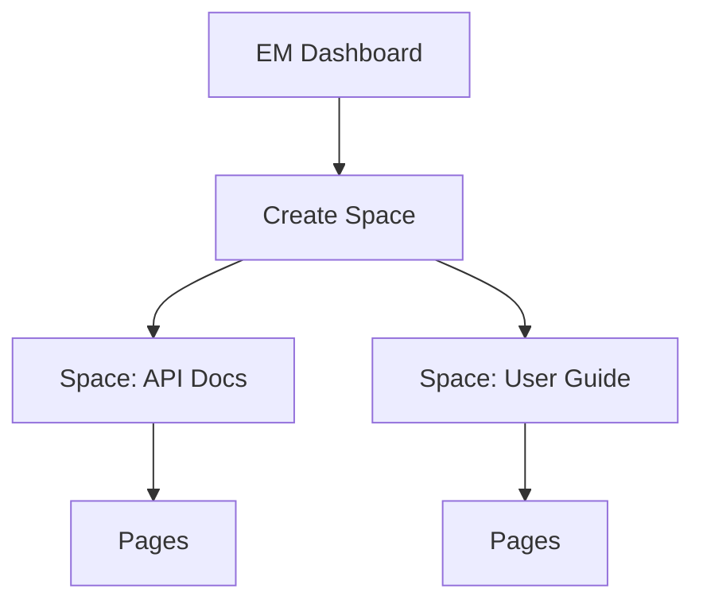
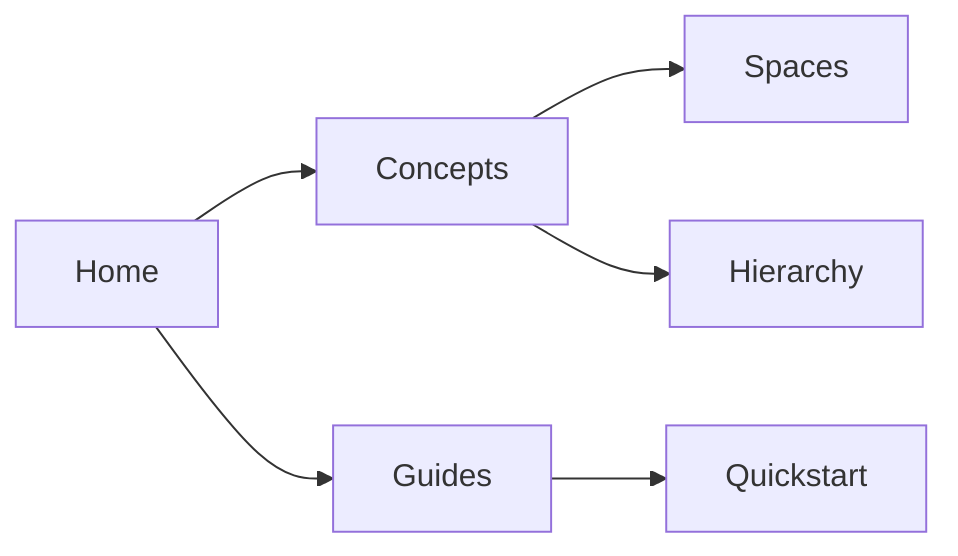

## Overview

EM Documentation provides a flexible system to create and manage your project documentation. You organize content into spaces, build page hierarchies, and use powerful tools for content management. These core concepts help you structure knowledge effectively.

<Columns cols={3}>
  <Card title="Spaces" icon="database" href="#">
    Group related documentation into isolated spaces for different projects or teams.
  </Card>
  <Card title="Pages" icon="file-text" href="#">
    Create individual MDX pages with rich components and markdown.
  </Card>
  <Card title="Hierarchy" icon="git-branch" href="#">
    Nest pages to reflect your project's structure and navigation.
  </Card>
</Columns>

## Documentation Spaces

Spaces act as top-level containers for your documentation. You create a space for each project, team, or product to keep content organized and accessible.

<Callout kind="tip">
  Start with one space per major project. Use descriptive names like `api-docs` or `user-guide`.
</Callout>

To set up a space, navigate to the dashboard and select **Create Space**. Assign permissions to control access.



Spaces support custom branding, such as your brand color `#3B82F6`.

## Page Hierarchy

Pages form a tree-like structure. You define hierarchy through folder organization or frontmatter navigation. This creates intuitive sidebar navigation for users.

<Steps>
  <Step title="Create Root Page" icon="file-plus">
    Add a new MDX file at the root of your space, like `index.mdx`.
  </Step>
  <Step title="Add Child Pages" icon="folder-plus">
    Create subfolders or use frontmatter `nav` arrays for nesting.
  </Step>
  <Step title="Link Pages" icon="link">
    Reference child pages with relative paths like `./subpage.mdx`.
  </Step>
</Steps>

View your hierarchy visually:



## Content Management

Manage page content using markdown, MDX components, and version control. Choose methods based on your needs.

<Tabs>
  <Tab title="Markdown Basics" icon="edit-3">
    Use standard syntax for text, lists, and tables.

    ```
    ## Heading

    - List item
    - Another item

    | Feature | Benefit |
    |---------|---------|
    | Fast    | Quick loads |
    ```

    Add images with ``.
  </Tab>
  <Tab title="MDX Components" icon="code">
    Enhance pages with interactive elements.

    <CodeGroup tabs="Callout,Card">
    ````jsx
    <Callout kind="info">
      Tip content here.
    </Callout>
    ````

    ````jsx
    <Card title="Feature" icon="star" href="#">
      Description.
    </Card>
    ````
    </CodeGroup>
  </Tab>
</Tabs>

<Expandable title="Advanced Tips" default-open="false">
  Integrate Git for version history. Use frontmatter like this:

  ```yaml
  ---
  title: My Page
  description: Page summary
  ---
  ```

  Preview changes before publishing to ensure no parsing errors.
</Expandable>

<Callout kind="success">
  Regularly review your hierarchy to maintain clear navigation.
</Callout>